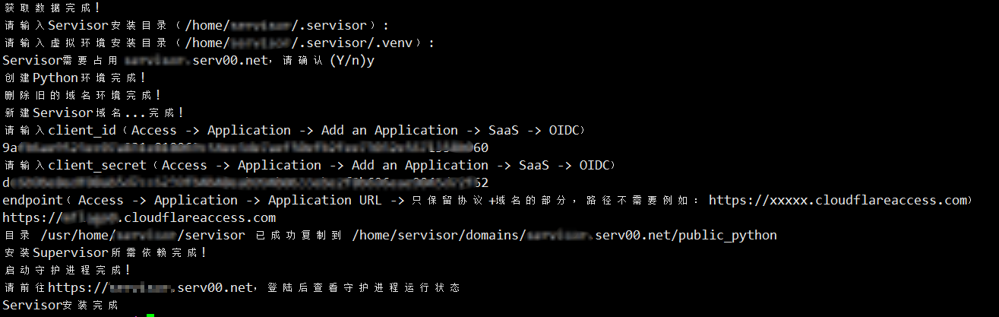
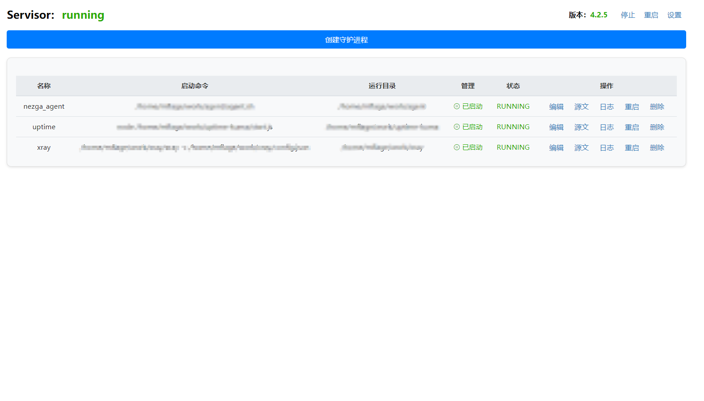

# Servisor

Servisor是一个基于 Python 的进程管理工具，旨在防止托管在 serv00/ct8 平台上的进程意外终止。它包括后端进程监控服务和用于用户管理的前端。此外，它还集成了 Cloudflare Access 作为 OAuth2 提供商，以增强安全性。


## 功能


进程守护：防止serv00/ct8终止您的程序

一键部署：轻松将Servisor部署在您的机器上，且不会占用您的端口

Cloudflare Access 集成：使用 OAuth2 对您的应用程序进行安全访问控制。

## 安装方式

### 前提
1.serv00/ct8账号, 如没有账号请 [注册](https://www.serv00.com/offer/create_new_account)

2.在Cloudflare Access获取Client ID、Client secret和Endpoint。具体请参考 [哪吒文档-使用 Cloudflare Access 作为 OAuth2 提供方](https://nezha.wiki/guide/q8.html)

3.Cloudflare Access回调url为 serv00 自带的域名+/oauth2/callback。例如https://xxxxx.serv00.net/oauth2/callback

### 开始安装
登录您的serv00/ct8在终端输入
```bash
python <(curl -Ls https://raw.githubusercontent.com/mflage0/servisor/main/install.py)
```
跟随指引完成您的部署


### 访问前端
通过 Serv00 提供的域访问您的托管站点。确保您通过 Cloudflare Access 进行身份验证以获得对监控仪表板的控制权。



### 保活
因serv00政策限制被托管网站24小时无请求将会暂停托管，请使用 [UptimeRobot](https://uptimerobot.com/) 进行监控。

地址为 https://xxxxx.serv00.net/web

## 演示

[Servisor](https://servisor.serv00.net/)(已去除认证)

[Nezha](http://nezha.servisor.serv00.net/)(被守护的哪吒面板)


## 故障排除
OAuth2 问题：如果您无法进行身份验证，请验证您的Client ID、Client secret和Endpoint。

访问出错：在一些负载高的机器上部署过程可能会出现问题，重新安装即可。

```json
{
"error": "invalid_request",
"error_description": "Invalid redirect_uri - does not match configured values"
}
```
如出现上述问题请检查Access -> Applications -> <应用名> -> Overview -> Redirect URLs中是否包含您的网址回调
